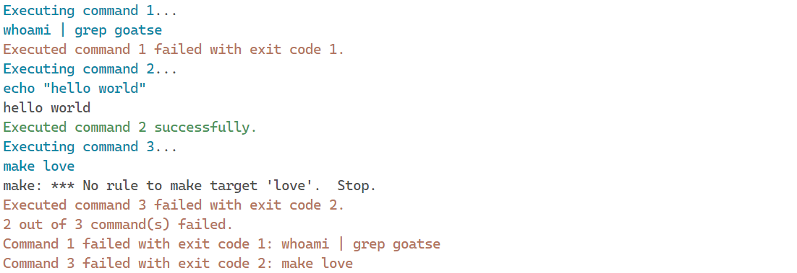

[](#project-status)
[](https://github.com/trallnag/exec-cmds-defer-errors/releases)
[](https://github.com/trallnag/exec-cmds-defer-errors/actions/workflows/ci.yaml)
[](https://github.com/trallnag/exec-cmds-defer-errors/actions/workflows/release.yaml)

# Exec-cmds-defer-errors

Small Python script that executes given commands commands and defers errors.

The standalone script is called `exec_cmds_defer_errors.py` and can be found
[here](src/exec_cmds_defer_errors.py). The license is included in the file.

Here it is used to run three commands:

```sh
uv run --script exec_cmds_defer_errors.py \
  'whoami | grep goatse' \
  'echo "hello world"' \
  'make love'
```

Note that in the example the script is executed with `uv run`, a subcommand of
[uv](https://docs.astral.sh/), which is a package manager for Python. This is
because the script contains
[inline script metadata](https://packaging.python.org/en/latest/specifications/inline-script-metadata/#inline-script-metadata)
specifying required dependencies. The script also contains a shebang, so it can
be executed directly.

The output will look like this:



## Shell completion

This program uses [Click](https://click.palletsprojects.com/en/stable/) for the
CLI. Click provides automatically generated shell completion for Bash, Fish, and
Zsh. Check out the official documentation
[here](https://click.palletsprojects.com/en/stable/shell-completion/).

## Project status

The project is maintained by me, [Tim](https://github.com/trallnag), and I am
interested in keeping it alive as I am actively using it.

I'm also using the project to test out various tools and workflows.

## Versioning

The project follows [Semantic Versioning](https://semver.org/).

## Contributing

Contributions are welcome. Please refer to [`CONTRIBUTE.md`](./CONTRIBUTE.md).

## Licensing

This work is licensed under the
[ISC license](https://en.wikipedia.org/wiki/ISC_license). See
[`LICENSE`](./LICENSE) for the license text.

The license is also included in the script
[`exec_cmds_defer_errors.py`](./src/exec_cmds_defer_errors/exec_cmds_defer_errors.py)
itself.

## Template

This project is based on the following
[Copier](https://copier.readthedocs.io/en/stable/) template:
<https://github.com/trallnag/copier-template-python-script>.
